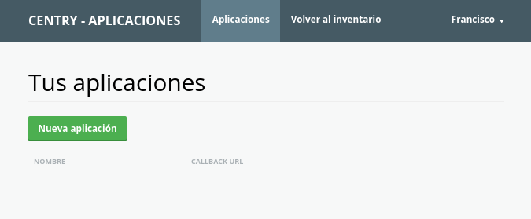
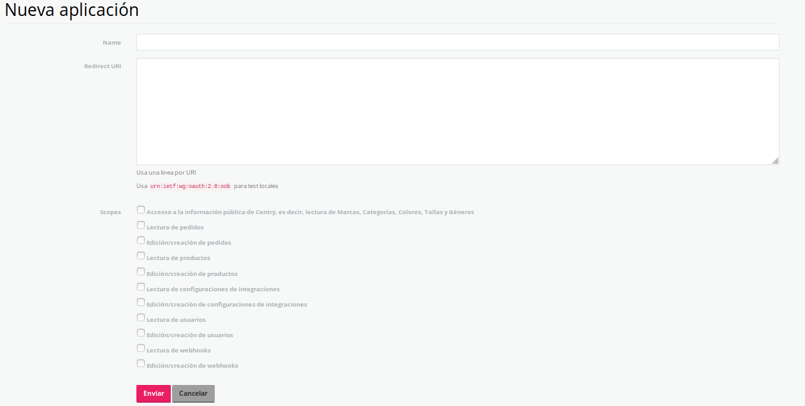
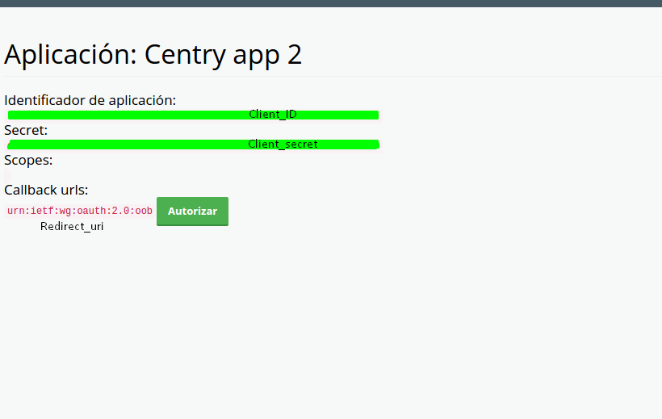
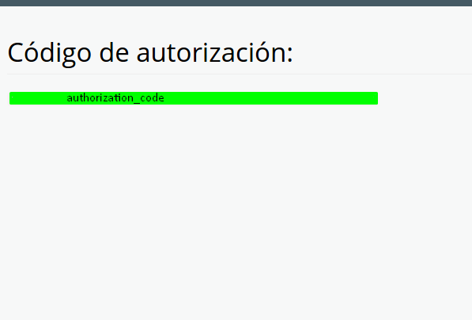

# Introduction

Bienvenido a la API de Centry. Puedes usar nuestra API para acceder a los endpoints, los que entregan variada
información sobre los recursos registrados en nuestra base de datos.

Puedes ver los códigos de ejemplo en la región oscura de la derecha y seleccionar el lenguaje de programación
que más te acomode en las pestañas que se encuentran en la parte superior.

# Authentication

Para poder interactuar desde tu aplicación con centry se debe solicitar las credenciales necesarias para que 
dicha conexión sea exitosa.
Dicho lo anterior se deben realizar los siguientes pasos.

## Primer paso ##
Ingresaremos a nuestro panel de [aplicaciones externas desde centry](https://www.centry.cl/oauth/applications)
Y le damos click a Nueva Aplicación.

Ingresaremos a nuestro panel de [aplicaciones externas desde centry](http://localhost:3000/oauth/applications)**borrame**




Se rellena el formulario que aparecerá para obtener las llaves de acceso. 



Finalizado este paso tendremos las llaves necesarias para la conexión 



Procedemos a autorizar estas credenciales, para obtener la llave de autorización



## Segundo paso

Configurar la conexión en nuestra app.

#### URL parameters ####

|   Parameter    |  Type  | Description                                                      |
|----------------|--------|------------------------------------------------------------------|
| `client_id`    | string | Tu id de cliente visto en el paso anterior <i class="label label-info">mandatory</i>            |
| `client_secret`| string | Id Secreto visto en el paso anterior <i class="label label-info">mandatory</i>                                                                        |
| `redirect_uri` | string | Dirección de redirección luego de consulta <i class="label label-info">mandatory</i> |
| `grant_type`   | string | Llave de autorización (authorization_code)<i class="label label-info">mandatory</i>                                                                             |
| `code`         | string | Llave de autorización (authorization_code) <i class="label label-info">mandatory</i>                                                |

>Para autorizar nuestra aplicación:

```shell


> To authorize, use this code:

```shell
# With shell, you can just pass the correct header with each request
curl "api_endpoint_here"
  -H "Authorization: tu_centry_api_key"

> Asegúrate de reemplazar `tu_centry_api_key` con tu API key.

Centry usa llaves para permitir el acceso a la API. Puedes registrar una nueva API key en nuestro 
[portal de desarrolladores](https://www.centry.cl/oauth/applications).

Centry espera que una API key sea incluída en todas las llamadas a la API en la cabecera de cada request tal como
lo muestra el ejemplo siguiente:

`Authorization: tu_centry_api_key`

<aside class="notice">
Debes reemplazar <code>tu_centry_api_key</code> con tu API key personal.
</aside>

